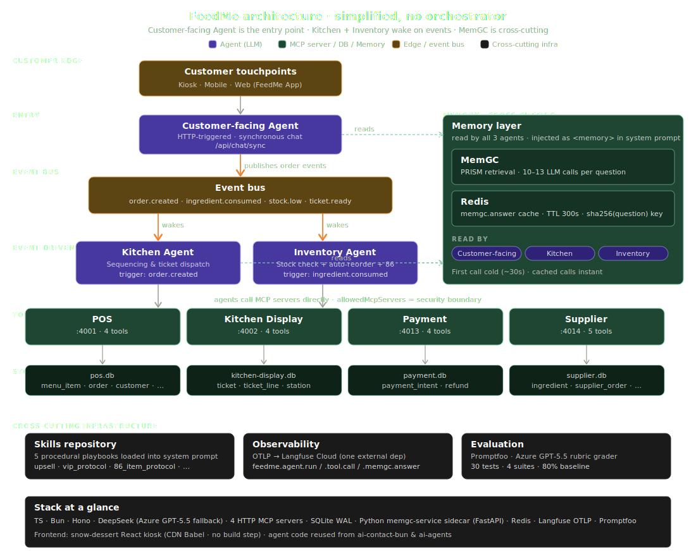
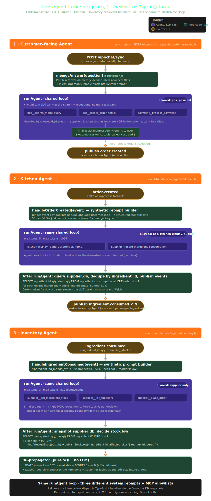
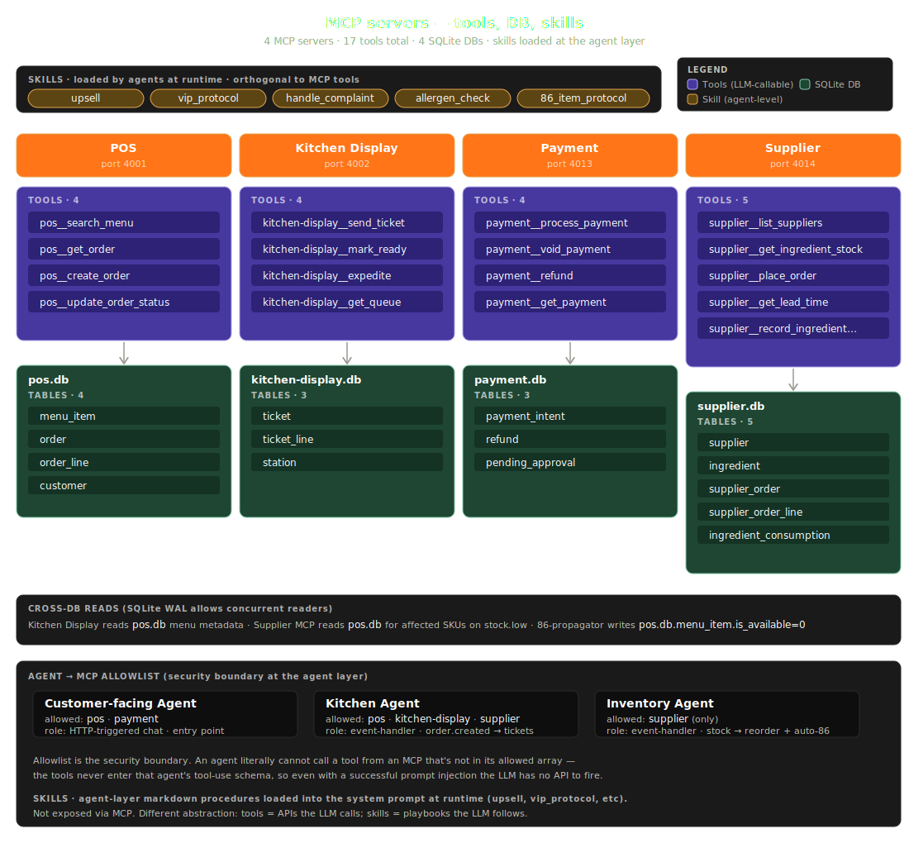
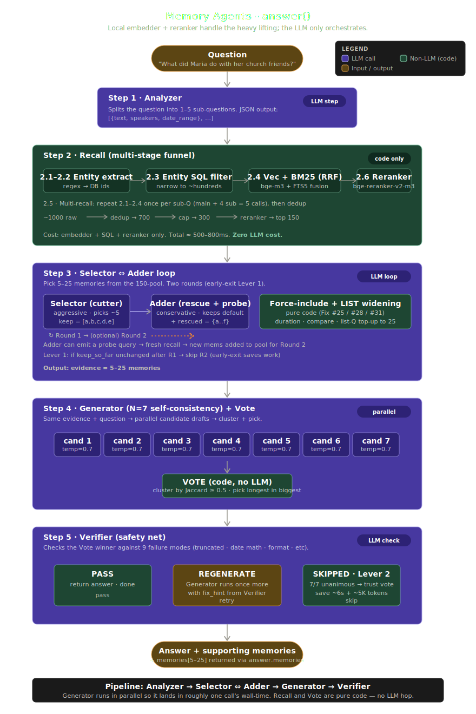

# FeedMe — Autonomous Restaurant Agent System

> A working prototype of a multi-agent AI runtime for F&B operations.
> Three agents collaborate over events and MCP tools to take orders, schedule the kitchen, and reorder inventory autonomously — with a real auto-86 chain wired end-to-end.

**Live demo →** [`feedm.carrickcheah.com`](https://feedm.carrickcheah.com/)
&nbsp;&nbsp;·&nbsp;&nbsp; **Stack** Bun · TypeScript · Hono · Azure GPT-5.5 · MCP · Kafka · Redis · OpenTelemetry · Langfuse · SQLite WAL · Docker · Caddy
&nbsp;&nbsp;·&nbsp;&nbsp; **Code** ~4.6k LOC TS + a Python sidecar
&nbsp;&nbsp;·&nbsp;&nbsp; **Evals** 30 cases across happy-path / multi-turn / edge-cases / red-team
&nbsp;&nbsp;·&nbsp;&nbsp; **CI/CD** Self-hosted runner, ~35s green deploys with auto-SSL

---

## What it does, in 60 seconds

A guest walks up to a kiosk (the live demo) and chats with a **customer-facing agent** that:

- Searches the menu over an **MCP server** with FTS5 + availability filters
- Recognises returning customers (e.g. *Sarah, peanut-allergic, VIP*) by pulling profile facts from **MemGC**, a 4-agent retrieval pipeline running as a Python sidecar
- Creates the order, then emits an `order.created` event

That event fans out to two more agents:

| Agent | Wakes on | Decides | Emits |
|---|---|---|---|
| **Kitchen** | `order.created` | Which station fires which ticket, what ingredients are consumed | `ingredient.consumed` |
| **Inventory** | `ingredient.consumed` | Whether to reorder from the preferred supplier; if stock dips below par, declare stock-low | `stock.low` |

A pure-SQL **86 propagator** then flips every menu item that depends on a stocked-out ingredient to `is_available = 0` — the kiosk's frontend reads that flag and the item disappears from the menu *automatically*, without anyone touching code or UI. That's the demo's headline moment.

---

## Architecture



Three orthogonal abstractions do all the heavy lifting:

1. **One agent loop, three personalities.** `src/agents/agent-base.ts` exports a single `runAgent()` that runs the LLM-call → tool-dispatch → repeat loop, with span instrumentation, cost accounting, and an `allowedMcpServers` allow-list baked in. Each agent is a ~100-line wrapper that supplies a job-specific system prompt + a tool whitelist. Adding a fourth agent is a copy-paste-edit, not a refactor.
2. **Events with a graceful fallback.** `src/events/publisher.ts` tries Kafka with a 3-second connect timeout; if the broker is unreachable, it directly invokes the in-process handler. Both paths converge on the **same** handler. The result: the demo runs end-to-end with zero infrastructure, but scales to Kafka the moment you bring a broker up.
3. **LLM for intent, TypeScript for fan-out.** Agents call MCP tools to reason about ambiguous input; downstream effects (which events to publish, which SKUs are affected) are computed by querying SQLite directly. Determinism for typed contracts, LLM only where ambiguity earns its cost.

### Agent flows

Same loop, different triggers — HTTP for chat, Kafka events (with in-process fallback) for kitchen + inventory.



---

## Engineering pillars

### Tool boundaries are the security model

The customer-facing agent literally cannot call kitchen or supplier tools — its `allowedMcpServers: ["pos", "payment"]` rejects everything else at dispatch time. This isn't a prompt convention; it's enforced by the loop. Forgetting the allow-list shows up immediately in traces with an `unauthorized_tool` span event.

| Agent | Allowed MCP servers |
|---|---|
| customer-facing | `pos`, `payment` |
| kitchen | `pos`, `kitchen-display`, `supplier` |
| inventory | `supplier` |

Each MCP server is one Hono process, owns one SQLite file (WAL), exposes a tight tool surface.



### Externalised prompts

System prompts live as `.md` files under `src/agents/prompts/` with `{{mustache}}` placeholders filled at call time. Non-engineers can tweak agent behaviour without touching TypeScript, prompts diff cleanly in code review, and the loader is a 30-line synchronous cache.

### Event-driven agents share the same loop as chat agents

Kitchen and Inventory are not chat-driven — they're triggered by events. Their handlers convert the event payload into a synthetic natural-language description + a structured `Compact form for tool args:` line, then feed that as the user-message into `runAgent()`. One loop serves both chat and event flows; one cost-tracking and tracing surface for everything.

### Streaming end-to-end

The chat endpoint emits OpenAI-streamed token deltas through a Hono SSE response (`event: chunk` / `event: done`). The frontend reads them with `response.body.getReader()` and renders Markdown progressively. First tokens visible in ~600ms; full reply in 2-4s.

### Observability: OpenTelemetry → Langfuse Cloud

Traces ship to **Langfuse Cloud** over its OTLP endpoint. Every LLM call, tool dispatch, and event fan-out is a span. We use OpenTelemetry directly (`@opentelemetry/sdk-node` + the OTLP HTTP exporter) instead of the `langfuse` npm SDK — point `LANGFUSE_BASE_URL` at Tempo, Honeycomb, or Phoenix to swap vendors with no code change. `import "./instrumentation"` is the **first** import in `src/index.ts` so the auto-instrumented OpenAI SDK is patched before any request fires.

### Memory as a retrieval pipeline, not a vector DB

`memgc-service/` is a Python FastAPI sidecar wrapping [`memgc-py`](https://github.com/) — the PRISM agentic retrieval loop (Analyzer → Selector ↔ Adder → Generator → Verifier). TypeScript calls it over HTTP with a Redis cache keyed by `sha256(question)` and a 300s TTL. Cold call ~30s; cached call <10ms.



### Single-tenant SQLite with WAL was a choice, not an accident

Four MCP servers open the same set of SQLite files (`pos.db`, `kitchen-display.db`, `supplier.db`, `payment.db`) with WAL mode enabled — concurrent readers, single writer, zero ops cost. Postgres + multi-tenancy + RLS is a deliberately deferred chapter.

### Promptfoo evals, graded by the same Azure deployment

30 cases under `evals/golden-set/`, four suites — happy-path, multi-turn, edge-cases, red-team. The rubric grader uses **the same** Azure GPT-5.5 deployment, so the whole evaluation stack has one external dependency and no `OPENAI_API_KEY` requirement. Empty outputs from Azure Content Safety are treated as PASS — defense-in-depth.

---

## Tech stack

| Layer | Choice | Why |
|---|---|---|
| Runtime | **Bun 1.3+** | Fast startup, built-in SQLite + test runner, single tool for run/install |
| HTTP | **Hono** | Tiny edge-style router, native SSE, plays well with Bun |
| LLM | **Azure OpenAI GPT-5.5** | `reasoning_effort` knob, content safety, EU-hosted |
| Streaming | **Server-Sent Events** | Simpler than WebSockets for unidirectional token delivery |
| Events | **Kafka (KRaft mode) → in-process fallback** | Production-grade contract, zero-infra dev |
| Memory | **MemGC PRISM** (Python sidecar) + **Redis** cache | Agentic retrieval over LM-friendly facts; cache hides cold-start |
| Storage | **SQLite WAL** | One file per bounded context, concurrent reads |
| MCP | **HTTP JSON-RPC** (not stdio) | Multiple servers concurrent, language-agnostic |
| Observability | **OpenTelemetry → Langfuse Cloud** | Vendor-neutral, no SDK lock-in |
| Edge | **Caddy** + Let's Encrypt | Auto-SSL via ACME HTTP-01, single-line reverse proxy |
| CI/CD | **Self-hosted GitHub Actions runner** | No SSH, no billing, ~35s deploys |
| Container | **Docker Compose** (5-service stack) | One file describes the whole topology |

---

## Project layout

```
src/
  index.ts                    Hono entry; instrumentation FIRST import
  instrumentation.ts          OTLP exporter → Langfuse Cloud
  config/env.ts               Zod-validated environment, per-agent resolver
  brain/                      Azure client + MCP HTTP client + tool adapters
  agents/
    agent-base.ts             runAgent() — the shared multi-turn loop
    customer-facing.ts        Synchronous, HTTP-triggered (chat)
    kitchen.ts                order.created → ingredient.consumed
    inventory.ts              ingredient.consumed → stock.low
    prompts/*.md              Externalised system prompts
  events/
    publisher.ts              Kafka → in-process fallback
    consumers.ts              Kafka consumers (when broker is up)
    86-propagator.ts          Pure-SQL stock.low → menu_item.is_available=0
    types.ts                  Typed event envelopes
  memgc-client.ts             HTTP wrapper for MemGC with Redis cache
  lib/tracing.ts              traced() / addSpanAttrs() helpers
  api/                        /api/chat, /api/admin/{kitchen,inventory}-stats
mcp-servers/{pos,kitchen-display,payment,supplier}/
  index.ts                    Hono JSON-RPC server
  tools.ts                    Tool definitions + handlers
  schema.sql + client.ts      SQLite schema + bun:sqlite client
memgc-service/                Python FastAPI sidecar (uv-managed)
snow-dessert/                 React kiosk UI (no build step — CDN Babel)
evals/golden-set/             30 Promptfoo cases, 4 yaml suites
docs/                         Architecture diagrams + design notes
deploy/                       Caddyfile + idempotent deploy.sh
```

---

## Quickstart

```bash
# 1. Clone & install
bun install

# 2. Copy the env template and fill in credentials
cp .env.example .env

# 3. Boot the four MCP servers + main app
bun run mcp:all   # in one terminal
bun run dev       # in another (port 8002)

# 4. (Optional) Boot Kafka + Redis + MemGC for the full stack
bun run infra:up
make memgc:up

# 5. Open the kiosk
cd snow-dessert && bun run dev
```

Without any infra the app still works — events fall back to in-process, MemGC fails open, and the demo runs cleanly off SQLite alone.

---

## Evals

```bash
bun run eval         # full 30-case suite (~60s, ~$0.30 Azure)
bun run eval:happy   # one suite for fast iteration
bun run eval:view    # open the HTML dashboard
```

Suites cover:

- **Happy path** — order placement, modifications, menu queries
- **Multi-turn** — context carries across 3-5 turn dialogues
- **Edge cases** — empty cart, 86'd items, unknown SKUs, payment retries
- **Red team** — prompt injection, off-topic refusal, refund manipulation, allergen safety

---

## Production

The live site runs on a Docker Compose stack — five containers (Caddy, app, MCP, MemGC, Redis), one named volume per persisted DB, automatic HTTPS via Let's Encrypt, and a self-hosted GitHub Actions runner that pulls + rebuilds + restarts on every push to `main`. Total deploy time from `git push` to green health-check: **34-38 seconds**.

```
push → self-hosted runner → docker compose up -d --build → /health → public probe
```

DNS is automated via the Cloudflare API; no manual dashboard clicks anywhere in the pipeline. Caddy handles cert issuance and renewal — zero manual ops after the first boot.

---

## Architecture diagrams

| Diagram | What it shows |
|---|---|
| [`docs/chart_feedme_architecture.svg`](docs/chart_feedme_architecture.svg) | Master map — every box maps to a file or service |
| [`docs/chart_agent_flows.svg`](docs/chart_agent_flows.svg) | Per-agent loop trace |
| [`docs/chart_agent_flow_kitchen_inventory.svg`](docs/chart_agent_flow_kitchen_inventory.svg) | Event-driven Kitchen + Inventory dance |
| [`docs/chart_mcp_servers.svg`](docs/chart_mcp_servers.svg) | MCP topology, ports, schemas |
| [`docs/chart_memgc_answer_flow.svg`](docs/chart_memgc_answer_flow.svg) | PRISM retrieval pipeline inside MemGC |

---

## Scope decisions (the things deliberately not built)

A senior signal is knowing what *not* to add. These are intentional gaps, not oversights:

- **No Postgres.** SQLite WAL fits the prototype's blast-radius. The migration is a chapter, not a refactor.
- **No multi-tenancy or RLS.** Single restaurant, one schema, one set of credentials. Would change every query if added — wait for a real customer.
- **No real payment integration.** The `payment__refund` tool is *intentionally* locked at the agent level — agents have no business issuing refunds without human review.
- **No tax computation.** `SST_PERCENT=0` is checked in, with a comment.
- **No WhatsApp / mobile clients.** Web kiosk only, until a real channel justifies the complexity.

---

## What's interesting if you read the code

A short tour for reviewers:

1. **`src/agents/agent-base.ts`** — read this first. It's the entire agent runtime in one file.
2. **`src/events/publisher.ts`** — see how the Kafka-or-in-process pattern works in 60 lines.
3. **`src/events/86-propagator.ts`** — pure SQL, no agent. The 86 chain is provably correct.
4. **`mcp-servers/pos/tools.ts`** — the tool-definition / handler pattern, with `list_recent_orders` as the cleanest recent example.
5. **`src/agents/prompts/customer-facing.md`** — the actual system prompt that runs in production. No magic.
6. **`evals/golden-set/red-team.yaml`** — five adversarial cases, all rubric-graded.

---

## License

Apache 2.0 — built as a portfolio prototype; reuse anything useful.
