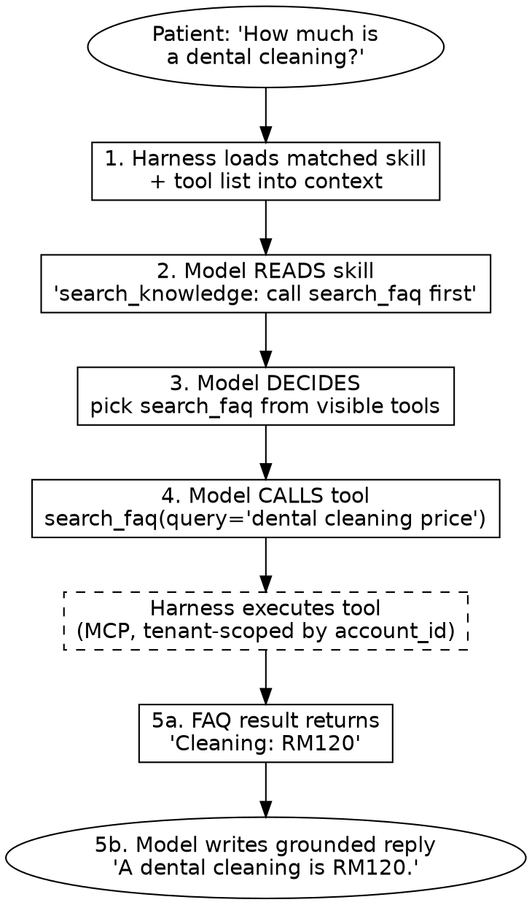

# 001 — Tools / Actions

> Harness sub-domain #1. Question it owns: **"What can the agent do?"**
> Demo tenant: Awesome Healthcare (synthetic data).

## Core distinctions

- **Tool** = a callable action (the *means*). e.g. `mcp__chat_now__search_faq`.
- **Skill** = a workflow doc that *references* tools (the *recipe*). Lives in context, not code.
- **Outcome** = the problem solved (the *ends*). e.g. "patient gets an answer at 2am".
- Direction of reference: **Skill → references → Tool** (never the reverse).
- Analogy: tools are the model's **hands (act) and eyes (read)**; a brain with no tools
  can only talk and will hallucinate, because it can't perceive or act on the real world.
- Harness twist: the Tools sub-domain is as much about **bounding** the action space
  (`LOCKED_REVIEW_ACTIONS` removes "refund") as about adding capability.

## The sequence (skill read BEFORE tool call)

1. Skill + tool list loaded into context (before the model decides anything)
2. Model **READS the skill** → "for a question, call search_faq first"
3. Model **DECIDES which tool** → picks search_faq from the visible tool list
4. Model **CALLS the tool** → harness executes it, returns result
5. Model **reads result** → calls another tool OR writes the reply

## Workflow — FAQ example (DOT)



```
   Patient question
        │
        ▼
   [1] load skill + tools into context
        │
        ▼
   [2] model READS skill  ── "call search_faq first"
        │
        ▼
   [3] model DECIDES  ── picks search_faq
        │
        ▼
   [4] model CALLS  ── search_faq(query=...)
        │
        ▼
   harness executes (tenant-scoped by account_id)
        │
        ▼
   [5] result returns ── grounded reply to patient
```

## Summary (precise, 2–3 sentences)

A tool is a callable action (the model's hands and eyes); a skill is a recipe that references
which tool to use and when. The harness loads the matched skill into context *before* the model
acts, so the model reads the recipe, picks the right tool, calls it, and grounds its reply in the
real result instead of hallucinating. The Tools sub-domain therefore defines both what the agent
*can* do and — just as importantly — what it is *not allowed* to do.
