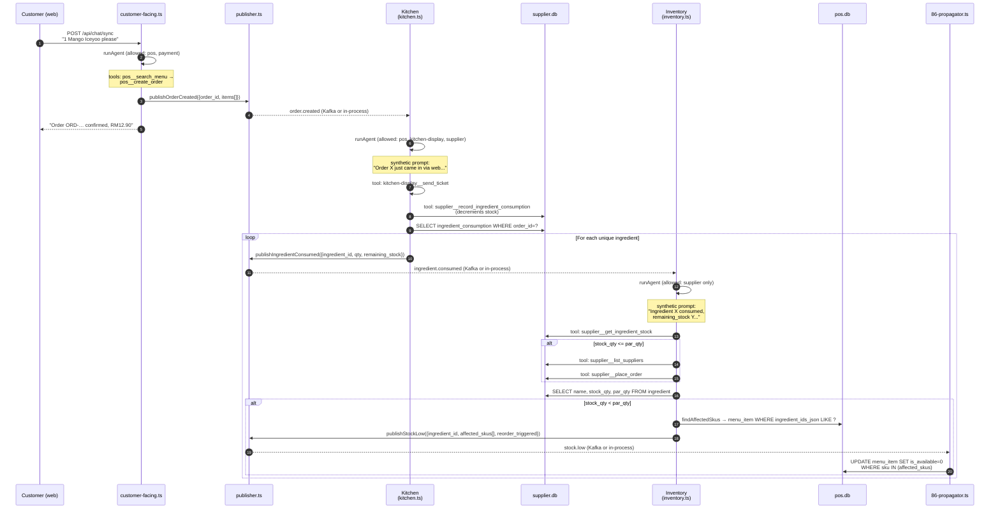

# How the Kitchen + Inventory agents work

**Scope:** the two background, event-driven agents — not the chat-driven customer-facing one.

The customer-facing agent is **synchronous**: HTTP request in → tool calls → response back. Kitchen and Inventory are **asynchronous**: an event wakes them, they run, they emit downstream events, nothing returns to a user.

---

## The pattern in one sentence

> Each event-driven agent is a thin handler that **converts an event payload into a synthetic user message**, runs the shared multi-turn tool loop with a job-specific system prompt + MCP allowlist, then **publishes the next event** based on the resulting DB state.

That's it. Everything else is plumbing.

---

## The shared shape

Both `kitchen.ts` and `inventory.ts` follow the same 4-step recipe:

```
1. handle*(event)                            ← signature accepts a typed event payload
2. runAgent({
     agent, systemPrompt, userMessage,       ← userMessage = natural-language version of the event
     allowedMcpServers, sessionId,
     maxCompletionTokens, maxAgentTurns,
   })
3. Inspect resulting DB state                ← query supplier.db / pos.db directly
4. publish*(downstream-event)                ← fire the next link in the chain
```

The only differences are: which event triggers it, which prompt + MCP allowlist it gets, and which downstream event it emits.

| | Kitchen Agent | Inventory Agent |
|---|---|---|
| **File** | `src/agents/kitchen.ts` | `src/agents/inventory.ts` |
| **Triggered by event** | `order.created` | `ingredient.consumed` |
| **Handler function** | `handleOrderCreated(event)` | `handleIngredientConsumed(event)` |
| **MCP allowlist** | `pos`, `kitchen-display`, `supplier` | `supplier` only |
| **Max turns** | 5 | 3 |
| **Max completion tokens** | 1024 | 512 |
| **Tools it typically calls** | `kitchen-display__send_ticket`, `supplier__record_ingredient_consumption` | `supplier__get_ingredient_stock`, `supplier__list_suppliers`, `supplier__place_order` |
| **Downstream event** | `ingredient.consumed` (one per unique ingredient) | `stock.low` (only if `stock_qty < par_qty`) |

---

## Routing — Kafka or in-process fallback?

The publisher (`src/events/publisher.ts`) tries Kafka first. If Kafka is unreachable (no broker, timeout, etc.), it **directly invokes the in-process handler** as a fallback. The handler signature is identical either way:

```ts
async function publishOrderCreated(data: OrderCreatedData) {
  try {
    await kafkaProducer.send({ topic: "order.created", ... });   // Kafka path
  } catch {
    await kitchenHandleOrderCreated(data);                       // in-process path
  }
}
```

So for the demo, `make up` is optional. Without Kafka, the chain still runs — it's just synchronous function calls under the hood. Same code paths in Kitchen + Inventory, same DB writes, same downstream events.

---

## End-to-end flow (Mermaid)



---

## The "synthetic user message" trick

Both agents share the same `runAgent()` loop as customer-facing — which expects a `userMessage` string. But Kitchen and Inventory have no user, only events. So each handler **renders the event payload into a natural-language paragraph** and feeds it in as the user turn.

Example from `kitchen.ts`:

```ts
function buildOrderEventMessage(event: OrderCreatedEvent): string {
  const itemsLine = event.items.map((i) => `${i.qty}× ${i.sku}`).join(", ");
  return `Order ${event.order_id} just came in via ${event.channel}${
    event.customer_id ? ` from customer ${event.customer_id}` : " (anonymous)"
  }.

Items:
${event.items.map((i, idx) => `  ${idx + 1}. sku="${i.sku}" qty=${i.qty}`).join("\n")}

Compact form for tool args: order_id="${event.order_id}", items=${JSON.stringify(event.items)}

Schedule: call kitchen-display__send_ticket with this order, then supplier__record_ingredient_consumption with the resulting ticket_id.

Summary: ${itemsLine}.`;
}
```

The prompt does two jobs at once:
1. **Describes the event** in prose the LLM can reason about.
2. **Hands over the structured payload** (`Compact form for tool args: order_id="…", items=…`) so the agent can copy-paste it into tool arguments without re-typing — drastically cuts the chance of the LLM corrupting an SKU.

System prompt then constrains the agent to a 2-step procedure: send_ticket THEN record_ingredient_consumption with the returned ticket_id.

Same trick in `inventory.ts` — the event payload becomes a paragraph that ends with "Check whether `ing_*` needs reordering."

---

## Why some logic is in the handler, not the agent

Notice that in `kitchen.ts`, the **agent doesn't publish `ingredient.consumed`**. The agent just calls `supplier__record_ingredient_consumption` (a DB write). Then the handler queries `supplier.db` itself, dedupes by `ingredient_id`, and emits one event per unique ingredient.

Same in `inventory.ts`: the agent calls `supplier__place_order`, but the **handler** snapshots the current stock, looks up affected SKUs in `pos.db`, and decides whether to publish `stock.low`.

**Why split it this way:**

1. **Determinism for downstream events.** Whether or not the LLM remembered to call `supplier__list_suppliers` first, the post-agent query against `supplier.db` is the source of truth for "what's the current stock?"
2. **The agent's output stream is logs, not contracts.** Trying to parse "publish 3 ingredient.consumed events" out of an LLM-generated paragraph is brittle. SQL is not.
3. **Idempotency.** If Kitchen agent retries (say, the LLM hit a turn limit on the first attempt), the consumption rows in `supplier.db` already exist — the handler dedupes by `ingredient_id` before publishing.

The LLM does the **reasoning + tool dispatch + intent**. The TypeScript handler does the **event fan-out + DB snapshot**. Each does the part it's good at.

---

## What the final `stock.low → 86` propagator is NOT

`src/events/86-propagator.ts` is **not** an agent. It's a 35-line SQL writer:

```ts
export async function handleStockLow(event: StockLowData): Promise<void> {
  for (const sku of event.affected_skus) {
    UPDATE menu_item SET is_available = 0 WHERE sku = ?
  }
}
```

The decision *which* SKUs to 86 was made by the Inventory agent (`findAffectedSkus()`). The propagator just commits it. There's no LLM in this step because there's no ambiguity — at this point we have a typed list of strings and a SQL statement.

**Rule of thumb:** if the step requires natural language understanding, ingredient substitution reasoning, or vendor selection — agent. If it's "given this list, run this SQL" — plain code.

---

## Span hierarchy in Langfuse (what you see in the trace)

For one `POST /api/chat/sync` request that triggers the full chain:

```
feedme.agent.run                                            (customer-facing)
├─ feedme.tool.call (pos__search_menu)
├─ feedme.tool.call (pos__create_order)
└─ HTTP POST → publisher
    └─ feedme.agent.run                                     (kitchen)
       ├─ feedme.tool.call (kitchen-display__send_ticket)
       ├─ feedme.tool.call (supplier__record_ingredient_consumption)
       └─ (per ingredient)
          └─ feedme.agent.run                               (inventory)
             ├─ feedme.tool.call (supplier__get_ingredient_stock)
             ├─ feedme.tool.call (supplier__list_suppliers)
             ├─ feedme.tool.call (supplier__place_order)
             └─ (in 86-propagator — pure SQL, no span)
```

Each `feedme.agent.run` span carries attributes: `feedme.agent`, `feedme.session_id`, `feedme.tokens.input/output/reasoning`, `feedme.cost_usd`, `feedme.tools_called.count`, `feedme.success`. Click any one in Langfuse to see the prompt, the tool calls, and the cost.

---

## File pointers

| Concern | File |
|---|---|
| Shared multi-turn tool loop | `src/agents/agent-base.ts` |
| Kitchen handler + prompt | `src/agents/kitchen.ts` |
| Inventory handler + prompt | `src/agents/inventory.ts` |
| Kafka producer + in-process fallback | `src/events/publisher.ts` |
| Typed event payloads | `src/events/types.ts` |
| Kafka consumers (when broker is up) | `src/events/consumers.ts` |
| `stock.low` → SQL 86 | `src/events/86-propagator.ts` |
| Span helpers | `src/lib/tracing.ts` |
